# Architecture Backend et Infrastructure pour EduConnect

Voici une proposition d'architecture backend et d'infrastructure complète pour la plateforme EduConnect.

## Architecture Backend

```mermaid
flowchart TD
    Client["Client Web/Mobile"]
    HTTPS["HTTPS"]
    JWT["JWT"]
    Gateway["API Gateway"]
    Auth["Service d'Authentification"]
    Users["Service Utilisateurs"]
    Courses["Service Cours"]
    Messaging["Service Messagerie"]
    Grades["Service Notes"]
    Attendance["Service Absences"]
    Schedule["Service Emploi du temps"]
    Resources["Service Ressources"]
    Analytics["Service Analytique"]
    Notifications["Service Notifications"]
    AI["Service IA"]
    DBUsers["Base de données Utilisateurs"]
    DBCourses["Base de données Cours"]
    DBMessaging["Base de données Messagerie"]
    DBGrades["Base de données Notes"]
    DBAttendance["Base de données Absences"]
    DBResources["Base de données Ressources"]
    DBAnalytics["Base de données Analytique"]
    Cache["Cache Redis"]
    Queue["File d'attente"]
    Storage["Stockage Objets"]
    Search["Moteur de Recherche"]

    Client --> HTTPS
    HTTPS --> Gateway
    Gateway --> JWT
    JWT --> Auth

    Gateway --> Users
    Gateway --> Courses
    Gateway --> Messaging
    Gateway --> Grades
    Gateway --> Attendance
    Gateway --> Schedule
    Gateway --> Resources
    Gateway --> Analytics
    Gateway --> Notifications
    Gateway --> AI

    Users --> DBUsers
    Courses --> DBCourses
    Messaging --> DBMessaging
    Grades --> DBGrades
    Attendance --> DBAttendance
    Resources --> DBResources
    Analytics --> DBAnalytics

    Users --> Cache
    Courses --> Cache
    Messaging --> Cache
    Schedule --> Cache

    Notifications --> Queue
    AI --> Queue

    Resources --> Storage
    Courses --> Storage

    Users --> Search
    Courses --> Search
    Resources --> Search
```

### Services Backend

1. **API Gateway**

    1. Point d'entrée unique pour toutes les requêtes
    2. Gestion des routes et redirection vers les microservices
    3. Rate limiting et throttling
    4. Logging des requêtes

2. **Service d'Authentification**

    1. Gestion des identités et des sessions
    2. Authentification multi-facteurs
    3. Intégration OAuth pour connexion via Google, Microsoft
    4. Gestion des JWT (JSON Web Tokens)

3. **Service Utilisateurs**

    1. Gestion des profils (élèves, enseignants, parents, administrateurs)
    2. Gestion des établissements et des classes
    3. Permissions et rôles

4. **Service Cours**

    1. Gestion du contenu pédagogique
    2. Organisation des modules et leçons
    3. Suivi de progression

5. **Service Messagerie**

    1. Communication entre utilisateurs
    2. Gestion des conversations et groupes
    3. Notifications en temps réel

6. **Service Notes**

    1. Enregistrement et calcul des notes
    2. Bulletins et relevés
    3. Statistiques et moyennes

7. **Service Absences**

    1. Suivi des présences et absences
    2. Justificatifs et validation
    3. Alertes automatiques

8. **Service Emploi du temps**

    1. Planification des cours
    2. Gestion des salles et ressources
    3. Événements et calendrier

9. **Service Ressources**

    1. Gestion des documents pédagogiques
    2. Bibliothèque de médias
    3. Partage de ressources

10. **Service Analytique**

    1. Suivi des performances
    2. Tableaux de bord personnalisés
    3. Prédictions et recommandations

11. **Service Notifications**

    1. Alertes par email/SMS
    2. Notifications push
    3. Rappels et événements

12. **Service IA**

    1. Assistant pédagogique
    2. Recommandations personnalisées
    3. Analyse prédictive des performances

## Infrastructure Cloud

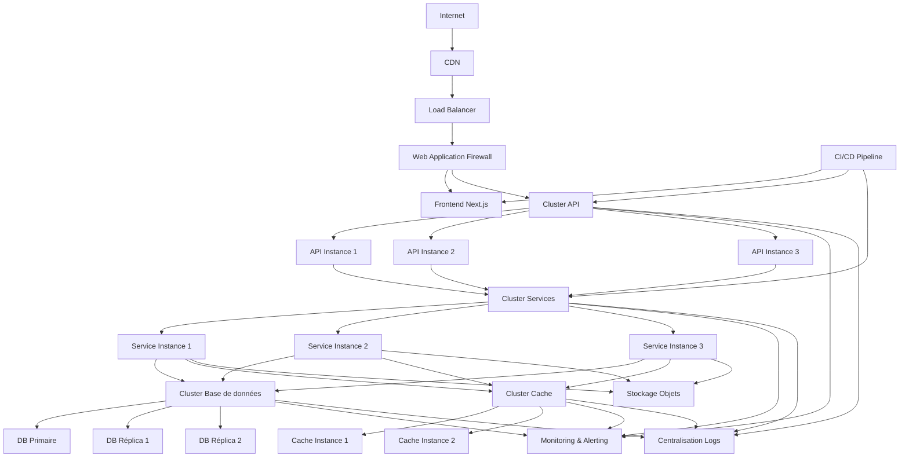

### Composants d'Infrastructure

1. **CDN (Content Delivery Network)**

    1. Distribution globale des assets statiques
    2. Mise en cache des contenus fréquemment accédés
    3. Réduction de la latence pour les utilisateurs

2. **WAF (Web Application Firewall)**

    1. Protection contre les attaques web (XSS, CSRF, injection SQL)
    2. Filtrage du trafic malveillant
    3. Conformité aux normes de sécurité

3. **Load Balancer**

    1. Répartition du trafic entre les instances
    2. Haute disponibilité et failover
    3. Health checks des services

4. **Clusters Kubernetes**

    1. Orchestration des conteneurs
    2. Auto-scaling basé sur la charge
    3. Déploiements sans interruption de service

5. **Base de données**

    1. Architecture primaire-réplica pour haute disponibilité
    2. Sharding pour la scalabilité horizontale
    3. Sauvegardes automatisées et point-in-time recovery

6. **Cache Redis**

    1. Mise en cache des données fréquemment accédées
    2. Sessions utilisateurs
    3. Réduction de la charge sur les bases de données

7. **Stockage Objets**

    1. Stockage des fichiers et médias
    2. Versioning et contrôle d'accès
    3. Réplication multi-régions

8. **Monitoring & Alerting**

    1. Surveillance en temps réel des performances
    2. Alertes automatiques en cas d'anomalies
    3. Tableaux de bord opérationnels

9. **Centralisation des Logs**

    1. Agrégation de tous les logs applicatifs
    2. Analyse et recherche
    3. Conservation à long terme pour audit

10. **CI/CD Pipeline**

    1. Intégration et déploiement continus
    2. Tests automatisés
    3. Rollbacks automatiques en cas d'échec

## Architecture de Données

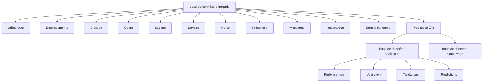

## Sécurité et Conformité

```mermaid
flowchart TD
    Securite["Sécurité"]

    Authentification["Authentification"]
    MultiFacteur["Multi-facteur"]
    SSO["Single Sign-On"]
    JWT["Tokens JWT"]

    Acces["Contrôle d'accès"]
    RBAC["RBAC"]
    Politiques["Politiques d'accès"]
    FiltrageIP["Filtrage IP"]

    Chiffrement["Chiffrement"]
    DonneesRepos["Données au repos"]
    DonneesTransit["Données en transit"]
    E2E["Chiffrement E2E"]

    Audit["Audit & Logs"]
    ActiviteUtilisateur["Activité utilisateur"]
    ActionsAdmin["Actions administratives"]
    EventsSystem["Événements système"]

    Conformite["Conformité"]
    RGPD["RGPD"]
    Mineurs["Protection des mineurs"]
    RegulationsLocales["Réglementations locales"]

    Securite --> Authentification
    Securite --> Acces
    Securite --> Chiffrement
    Securite --> Audit
    Securite --> Conformite

    Authentification --> MultiFacteur
    Authentification --> SSO
    Authentification --> JWT

    Acces --> RBAC
    Acces --> Politiques
    Acces --> FiltrageIP

    Chiffrement --> DonneesRepos
    Chiffrement --> DonneesTransit
    Chiffrement --> E2E

    Audit --> ActiviteUtilisateur
    Audit --> ActionsAdmin
    Audit --> EventsSystem

    Conformite --> RGPD
    Conformite --> Mineurs
    Conformite --> RegulationsLocales
```

## Intégrations Tierces

```mermaid
flowchart TD
    EduConnect["EduConnect"]

    Identite["Fournisseurs d'identité"]
    Google["Google"]
    Microsoft["Microsoft"]
    Apple["Apple"]

    Paiement["Passerelles de paiement"]
    Stripe["Stripe"]
    PayPal["PayPal"]
    MobileMoney["Mobile Money"]

    Communication["Communication"]
    Email["Service d'email"]
    SMS["Passerelle SMS"]
    Push["Notifications Push"]

    Contenu["Contenu éducatif"]
    Editeurs["Éditeurs"]
    Ressources["Ressources libres"]
    Video["Plateformes vidéo"]

    IA["Services IA"]
    OpenAI["OpenAI"]
    GoogleAI["Google AI"]
    CustomAI["IA personnalisée"]

    EduConnect --> Identite
    EduConnect --> Paiement
    EduConnect --> Communication
    EduConnect --> Contenu
    EduConnect --> IA

    Identite --> Google
    Identite --> Microsoft
    Identite --> Apple

    Paiement --> Stripe
    Paiement --> PayPal
    Paiement --> MobileMoney

    Communication --> Email
    Communication --> SMS
    Communication --> Push

    Contenu --> Editeurs
    Contenu --> Ressources
    Contenu --> Video

    IA --> OpenAI
    IA --> GoogleAI
    IA --> CustomAI
```

## Stratégie de Déploiement

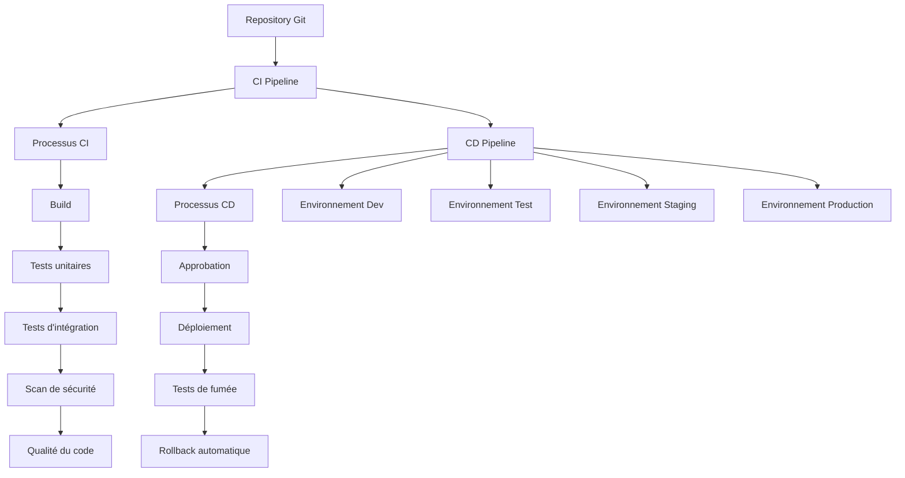

## Considérations Spécifiques pour l'Afrique

1. **Optimisation pour faible bande passante**

    1. Compression des données
    2. Mode hors ligne pour les ressources essentielles
    3. Synchronisation intelligente

2. **Support multi-langues**

    1. Français, anglais et langues locales
    2. Contenu adapté culturellement

3. **Paiements locaux**

    1. Intégration avec Mobile Money
    2. Options de paiement hors ligne
    3. Facturation adaptée aux établissements

4. **Hébergement régional**

    1. Datacenters en Afrique quand disponible
    2. Conformité avec les lois locales sur les données

5. **Résilience aux coupures**

    1. Gestion des interruptions de connexion
    2. Reprise automatique des opérations

Cette architecture est conçue pour être évolutive, permettant à EduConnect de commencer avec une infrastructure modeste
et de se développer en fonction de la croissance des utilisateurs et des besoins. Elle prend également en compte les
défis spécifiques du marché africain tout en offrant une plateforme robuste et sécurisée.

## Architecture Backend Monolithique Modulaire pour EduConnect

Voici une proposition d'architecture backend monolithique modulaire pour la plateforme EduConnect, adaptée au contexte
africain.

### Architecture Backend Monolithique Modulaire

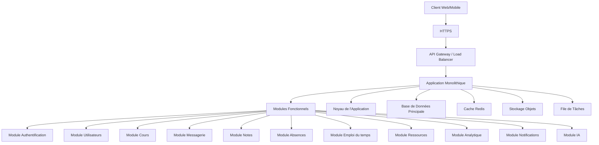

### Structure du Code Monolithique Modulaire

```mermaid
flowchart TD
    AppEduConnect["Application EduConnect"]

    Core["Core"]
    Modules["Modules"]
    Infrastructure["Infrastructure"]
    API["API"]
    Configuration["Configuration"]

    Common["Composants Communs"]
    EventSystem["Système d'Événements"]
    ExceptionHandling["Gestion d'Exceptions"]

    Auth["Auth"]
    Users["Users"]
    Courses["Courses"]
    Messaging["Messaging"]
    Grades["Grades"]
    Attendance["Attendance"]
    Schedule["Schedule"]
    Resources["Resources"]
    Analytics["Analytics"]
    Notifications["Notifications"]
    AI["AI"]

    Database["Database"]
    Caching["Caching"]
    Storage["Storage"]
    Queue["Queue"]
    Email["Email"]
    SMS["SMS"]
    Logging["Logging"]

    Controllers["Controllers"]
    Middleware["Middleware"]
    Routes["Routes"]
    Validation["Validation"]
    Documentation["Documentation"]

    ModuleStruct["Structure d'un Module"]
    ModControllers["Controllers"]
    ModServices["Services"]
    ModRepositories["Repositories"]
    ModModels["Models"]
    ModDTOs["DTOs"]
    ModValidators["Validators"]
    ModEvents["Events"]

    AppEduConnect --> Core
    AppEduConnect --> Modules
    AppEduConnect --> Infrastructure
    AppEduConnect --> API
    AppEduConnect --> Configuration

    Core --> Common
    Core --> EventSystem
    Core --> ExceptionHandling

    Modules --> Auth
    Modules --> Users
    Modules --> Courses
    Modules --> Messaging
    Modules --> Grades
    Modules --> Attendance
    Modules --> Schedule
    Modules --> Resources
    Modules --> Analytics
    Modules --> Notifications
    Modules --> AI

    Infrastructure --> Database
    Infrastructure --> Caching
    Infrastructure --> Storage
    Infrastructure --> Queue
    Infrastructure --> Email
    Infrastructure --> SMS
    Infrastructure --> Logging

    API --> Controllers
    API --> Middleware
    API --> Routes
    API --> Validation
    API --> Documentation

    Modules --> ModuleStruct
    ModuleStruct --> ModControllers
    ModuleStruct --> ModServices
    ModuleStruct --> ModRepositories
    ModuleStruct --> ModModels
    ModuleStruct --> ModDTOs
    ModuleStruct --> ModValidators
    ModuleStruct --> ModEvents
```

### Avantages de l'Architecture Monolithique Modulaire

1. **Simplicité de développement**

    1. Base de code unique et cohérente
    2. Facilité de débogage et de test
    3. Courbe d'apprentissage plus douce pour les nouveaux développeurs

2. **Modularité**

    1. Séparation claire des responsabilités
    2. Couplage faible entre les modules
    3. Possibilité de travailler sur des modules spécifiques

3. **Performance**

    1. Pas de latence due aux appels réseau entre services
    2. Optimisation des requêtes de base de données
    3. Gestion efficace de la mémoire

4. **Simplicité opérationnelle**

    1. Déploiement unique
    2. Surveillance et maintenance simplifiées
    3. Moins de complexité d'infrastructure

5. **Évolutivité**

    1. Possibilité d'extraire des modules en microservices à l'avenir
    2. Scaling vertical efficace pour les charges moyennes
    3. Possibilité de scaling horizontal avec plusieurs instances

### Infrastructure pour Monolithe Modulaire

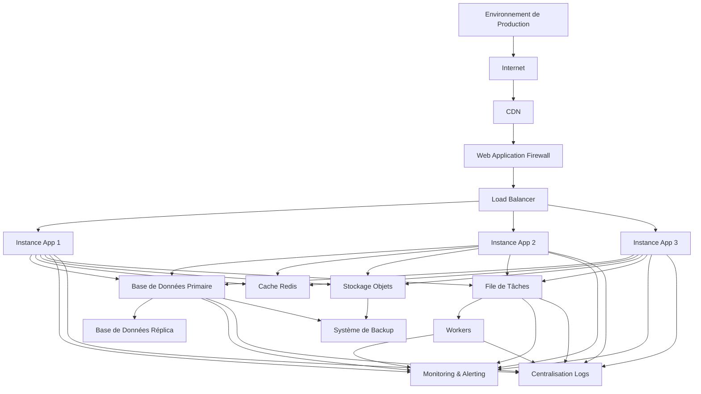

### Architecture de Base de Données

```mermaid
flowchart TD
    DBPrincipale["Base de Données Principale"]

    Users["Utilisateurs"]
    Roles["Rôles"]
    Permissions["Permissions"]
    Etablissements["Établissements"]
    Classes["Classes"]
    Matieres["Matières"]
    Cours["Cours"]
    Lecons["Leçons"]
    Devoirs["Devoirs"]
    Rendus["Rendus"]
    Notes["Notes"]
    Presences["Présences"]
    Messages["Messages"]
    Ressources["Ressources"]
    EDT["Emploi du temps"]
    Notifications["Notifications"]
    Analytics["Données Analytiques"]
    Params["Paramètres"]
    SystemLogs["Logs Système"]

    DBPrincipale --> Users
    DBPrincipale --> Roles
    DBPrincipale --> Permissions
    DBPrincipale --> Etablissements
    DBPrincipale --> Classes
    DBPrincipale --> Matieres
    DBPrincipale --> Cours
    DBPrincipale --> Lecons
    DBPrincipale --> Devoirs
    DBPrincipale --> Rendus
    DBPrincipale --> Notes
    DBPrincipale --> Presences
    DBPrincipale --> Messages
    DBPrincipale --> Ressources
    DBPrincipale --> EDT
    DBPrincipale --> Notifications
    DBPrincipale --> Analytics
    DBPrincipale --> Params
    DBPrincipale --> SystemLogs
```

### Stratégie de Déploiement

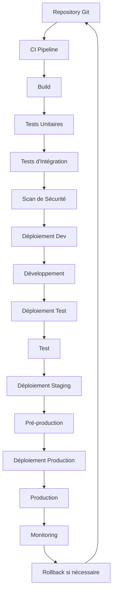

### Considérations Techniques Spécifiques

#### 1. Choix Technologiques

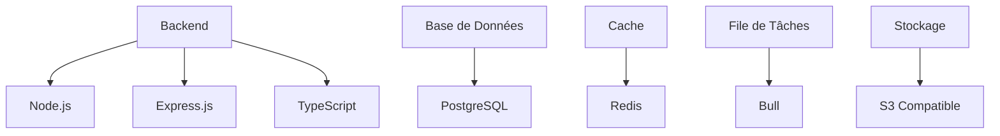

#### 2. Optimisations pour le Contexte Africain

1. **Performance avec Connexion Limitée**

    1. Compression des réponses API
    2. Mise en cache agressive
    3. Pagination optimisée des résultats
    4. API endpoints optimisés pour minimiser les données transférées

2. **Résilience aux Coupures**

    1. Transactions robustes avec retry patterns
    2. Mécanismes de reprise après échec
    3. Journalisation détaillée pour récupération

3. **Optimisation des Ressources**

    1. Utilisation efficace de la mémoire
    2. Pooling de connexions à la base de données
    3. Gestion optimisée des assets

#### 3. Sécurité

```mermaid
flowchart TD
    Securite["Sécurité"]

    Auth["Authentification"]
    JWT["JWT"]
    Sessions["Sessions"]
    MFA["Multi-facteur"]

    Authorization["Autorisation"]
    RBAC["RBAC"]
    Policies["Politiques"]

    DataProtection["Protection des Données"]
    Encryption["Chiffrement"]
    Masking["Masquage"]
    Anonymization["Anonymisation"]

    APIProtection["Protection API"]
    RateLimiting["Rate Limiting"]
    CORS["CORS"]
    CSP["CSP"]

    Compliance["Conformité"]
    RGPD["RGPD"]
    ChildProtection["Protection des Mineurs"]
    LocalLaws["Lois Locales"]

    Securite --> Auth
    Securite --> Authorization
    Securite --> DataProtection
    Securite --> APIProtection
    Securite --> Compliance

    Auth --> JWT
    Auth --> Sessions
    Auth --> MFA

    Authorization --> RBAC
    Authorization --> Policies

    DataProtection --> Encryption
    DataProtection --> Masking
    DataProtection --> Anonymization

    APIProtection --> RateLimiting
    APIProtection --> CORS
    APIProtection --> CSP

    Compliance --> RGPD
    Compliance --> ChildProtection
    Compliance --> LocalLaws
```

### Plan de Mise à l'Échelle

1. **Phase Initiale**

    1. Monolithe unique avec base de données unique
    2. Déploiement sur serveur unique ou petit cluster
    3. Focus sur la stabilité et les fonctionnalités de base

2. **Phase de Croissance**

    1. Scaling vertical du monolithe (plus de CPU/RAM)
    2. Réplication de la base de données
    3. Ajout de cache Redis
    4. Optimisation des requêtes et indexes

3. **Phase d'Expansion**

    1. Multiple instances du monolithe derrière un load balancer
    2. Séparation des workers pour les tâches en arrière-plan
    3. Sharding potentiel de la base de données
    4. CDN pour les assets statiques

4. **Phase de Maturité**

    1. Extraction potentielle de certains modules en services séparés
    2. Architecture hybride monolithe/microservices
    3. Optimisation fine basée sur les métriques d'utilisation
    4. Infrastructure multi-régions si nécessaire

### Avantages de cette Approche pour EduConnect

1. **Rapidité de développement initial**

    1. Mise sur le marché plus rapide
    2. Moins de complexité d'infrastructure à gérer

2. **Coûts d'infrastructure réduits**

    1. Ressources serveur optimisées
    2. Moins de composants à maintenir

3. **Simplicité opérationnelle**

    1. Déploiements plus simples
    2. Monitoring unifié
    3. Débogage plus facile

4. **Adaptabilité au contexte africain**

    1. Performance optimisée pour les connexions limitées
    2. Résilience aux problèmes d'infrastructure
    3. Coûts d'hébergement maîtrisés

5. **Évolutivité progressive**

    1. Possibilité d'évoluer vers une architecture plus distribuée à mesure que la plateforme se développe
    2. Extraction de modules spécifiques en services indépendants selon les besoins

Cette architecture monolithique modulaire offre un bon équilibre entre simplicité, performance et évolutivité, tout en
étant particulièrement adaptée au contexte africain et aux besoins d'EduConnect.